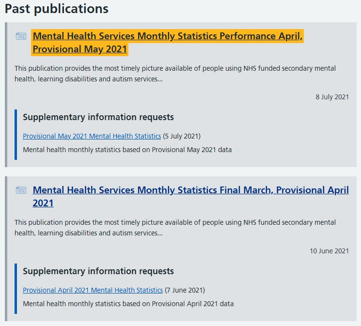
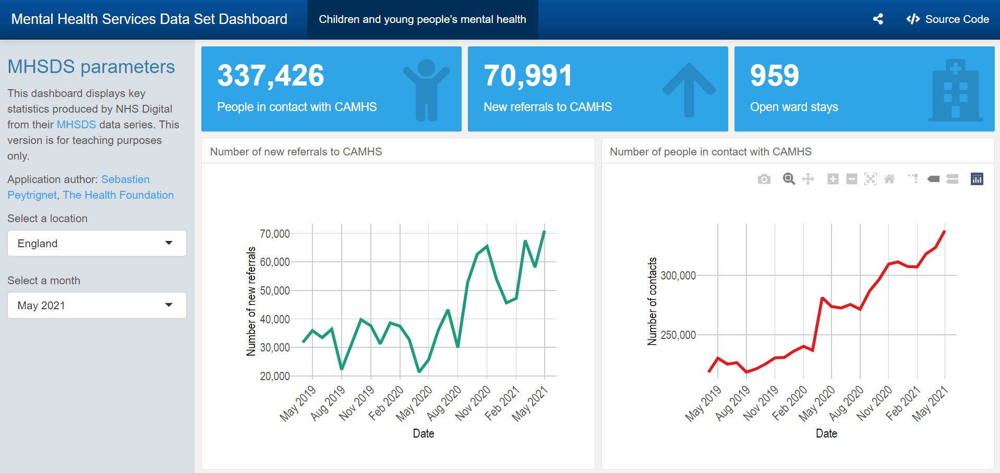

# Mental Health Services Dataset Pipeline

#### Project Status: [In progress]

## Project Description

- Each month, NHS Digital releases [key statistics](https://digital.nhs.uk/data-and-information/publications/statistical/mental-health-services-monthly-statistics) on the performance of mental health services in the NHS. Those are released as multiple spreadsheets each month, with a separate file for each type of measure (e.g. main performance stats, restrictive interventions, eating disorders, etc). See example below. Each sub-page contains multiple more links.

- Finding all the right files going back months can be time-consuming. If you're interested in time series data for more than one type of measure, this isn't made publicly available (to my knowledge) and there isn't a publicly available API either.

- To make things easier, I have put together a data pipeline that:
  - Web-scrapes the links to the CSVs you want, starting from the [MHSDS landing page](https://digital.nhs.uk/data-and-information/publications/statistical/mental-health-services-monthly-statistics) and working its way through the underlying pages for each monthly release
  - Downloads the required files into a local folder of your choice
  - Appends the CSVs into a single time-series file for each type of measure

- By running this pipeline each month, the code provided here identifies **new** files hosted on the NHS Digital website and downloads those (and only those!) before appending them to the time series

- This pipeline downloads two metrics for each monthly series:
  - The main performance indicators
  - Eating disorder indicators
- It could be adpated to include more types of metrics (e.g. Mental Health Act metrics or restrictive interventions).

- I have also provided some code that produces a simple [dashboard](https://sgpeytrignet.shinyapps.io/MHSDS-dashboard/) powered by flexdashboard. You can adapt this at the end of your pipeline to build a dashboard with the mental health metrics of your choice.

## How does it work?

1. Edit **0. File locations.R** with the location of the directory you would like to save your MHSDS files to. Start with an empty folder. For example, I have chosen 'rawdatadir' as _"/Users/sgpeytrignet/Documents/MHSDS data/"_. 
2. Run **1. MHSDS-data-cleaning.R** to download the desired MHSDS data locally, append them into a practical time-series files and do some basic data cleaning. This relies on a new function that fetches monthly series from the NHS Digital plage (e.g. _MHSDS_monthly_series_download("december 2020")_).  If you are doing this for the first time (or if new data has been released and it's time to refresh your data), set the 'refresh_data' parameter to _YES_. If you want to leave your data as is, set it to _NO_.
3. Now, you should be ready to start running some simple analysis or doing some visualizations, for example using a dashboard.
4. If you would like to create your own dashboard, feel free to adapt the **2. MHSDS-dashboard.Rmd** script!
 
## Requirements

The following R packages (available on CRAN) are needed:

* tidyverse
* lubridate
* here
* data.table
* DescTools
* pbapply
* rvest
* downloader
* curl

If you're interested in building your own dashboard, you'll also need the following packages:

* plotly
* hrbrthemes
* flexdashboard

## Useful references

If you would like a starter on building dashboards using flexdashboard, you can get started with this [resource](https://towardsdatascience.com/create-an-interactive-dashboard-with-shiny-flexdashboard-and-plotly-b1f025aebc9c?gi=2bfa806eaea7).

## Authors

* Sebastien Peytrignet - [Twitter](https://twitter.com/SebastienPeytr2) - [GitHub](https://github.com/sg-peytrignet)

## License

This project is licensed under the [MIT License](https://github.com/sg-peytrignet/MHSDS-pipeline/blob/main/LICENSE).
